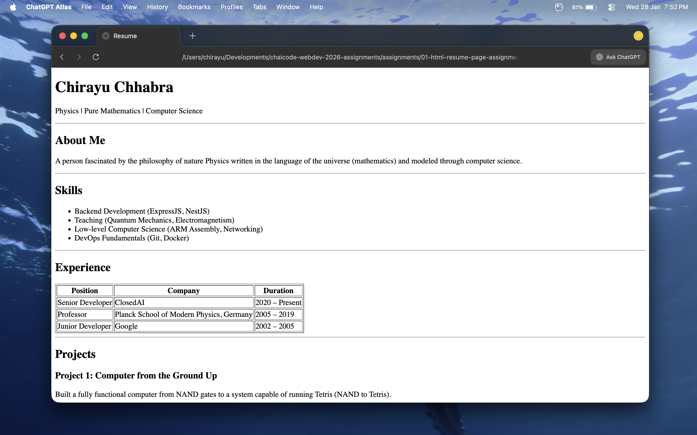
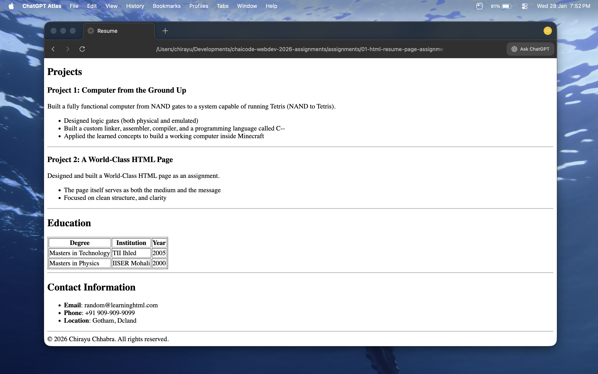

# HTML Resume Page Assignment

This project is an assignment to create a personal resume web page using only HTML.

## Project Structure

- `index.html`: The main HTML file containing the resume content.
- `assets/`: Folder containing output screenshots of the rendered resume page.

## Features

- Semantic HTML5 structure using tags like `<header>`, `<section>`, `<footer>`, and `
`.
- Proper heading hierarchy with `<h1>`, `<h2>`, and `<h3>` tags.
- Lists created with `<ul>` and `<li>` for grouping related items.
- Tabular data presented using `<table>`, `<thead>`, `<tbody>`, `<tr>`, `<th>`, and `<td>`.
- No CSS or JavaScript pure HTML.

## Output Screenshots

Below are screenshots of the rendered HTML resume page:

## How to View

1. Open `index.html` in your web browser.
2. You should see a well-structured resume page, as shown in the screenshots above.

---

© 2026 Chirayu Chhabra. MIT License.
